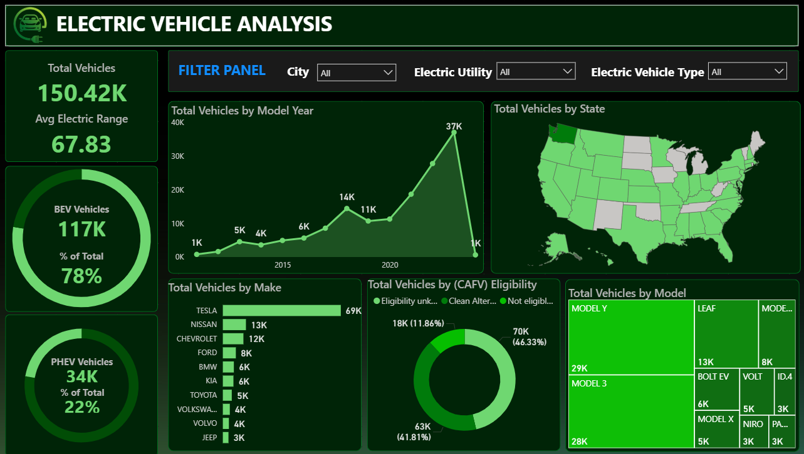
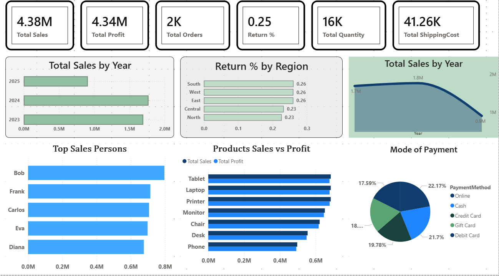
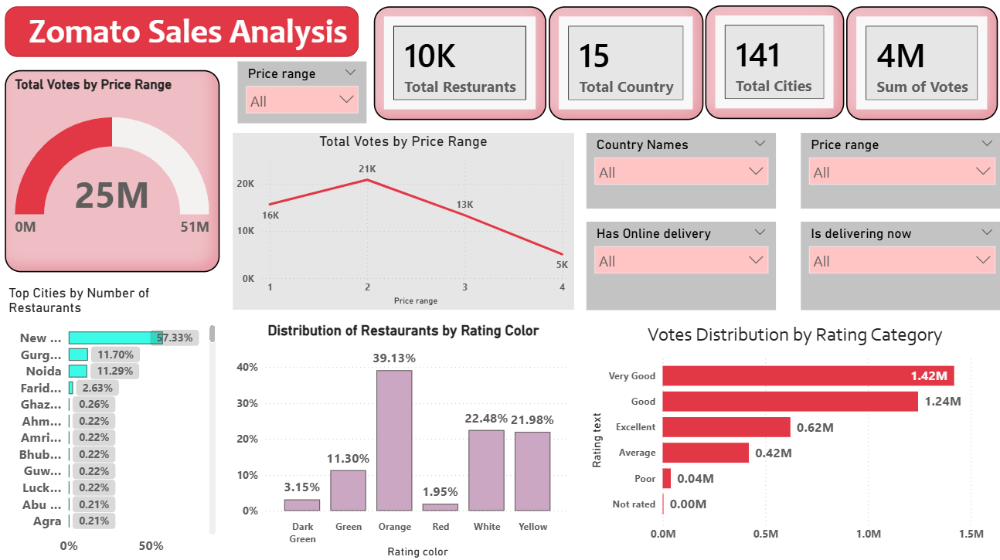

<p align="center">
  
</p>

> **Project 1 of my Data Analytics Portfolio.** A 3-page Power BI dashboard analyzing hospital admissions, patient demographics, and treatment costs across 10 major U.S. hospitals — built to demonstrate end-to-end skills in data modeling, DAX, and interactive dashboard design.

---

## 📁 Project Structure

```
Healthcare-Project/
│
├── Health ppt.pptx                        → Presentation summary of findings
├── Healthcare Analysis Dataset.xlsx        → Raw/cleaned source data
├── Healthcare_DAX_Documentations.pdf       → DAX formulas & measure documentation
├── National Health Analysis Dashboard.pbix → Power BI report file (main deliverable)
├── Key Trends.png                          → Screenshot: Page 1 of dashboard
├── Patients Demographics.png               → Screenshot: Page 2 of dashboard
└── Treatment & Cost.png                    → Screenshot: Page 3 of dashboard
```

> **Note:** All PNG screenshots live directly in this folder (not in a subfolder), so the README links below point to `./filename.png` — keep the images alongside `README.md` when uploading to GitHub or they won't render.

The report has **3 pages** with a consistent navigation bar (Patients Demographics / Key Trends / Treatment & Cost) and shared KPI cards on every page: **Admitted Patients, Rooms/Bedspace, Avg Billing Amount, Doctors, Avg LOS (Days), Avg Age**.

---

## 📊 Dashboard Overview


### 1. Patients Demographics


- **Blood group**: A+ most common (11.1K); more females than males across most groups.
- **Diagnostic results**: Abnormal 55% (31K), Inconclusive 35% (19K), Normal only 10% (5,550) — majority of admitted patients show abnormal or inconclusive results.
- **Hospital breakdown**: Houston Methodist Hospital leads with 20,402 total patients — over 3x the next largest, Johns Hopkins (11,268). Diabetes (5,104) and Hypertension (5,057) are its top conditions.
- Interactive medical condition selector with descriptive info panel (e.g., Arthritis).

### 2. Key Trends


- 55,500 admitted patients, 40,341 doctors, 400 rooms/bedspace, avg LOS 15.51 days, avg billing $25,539.
- **Admission by Day Type**: Weekday 71.49% vs Weekend 28.51%.
- **LOS Buckets**: Extended Stay (15+) is the largest bucket at **53.16%**, followed by Long Stay (8–14) at 23.44%, Moderate Stay (4–7) at 13.48%, and Short Stay (1–3) at 9.91%.
- **Monthly/Daily Breakdown**: Fairly even distribution across months (~4,500–4,900/month); August highest (4,832), February lowest (4,255); Wednesday busiest weekday overall (7,982 total).
- **Billing by admission type**: Elective, Emergency, and Urgent billing fluctuate seasonally between ~$24,800–$26,300 with no single type consistently highest.

### 3. Treatment & Cost


- **Billing by Length of Stay**: Extended Stay (15+) patients account for the majority of billing (~0.25bn per admission type), far above Short Stay (~0.04–0.05bn).
- **Billing by hospital**: Houston Methodist leads at 0.52bn — more than double Johns Hopkins (0.29bn) and roughly triple UCLA (0.18bn), consistent with its patient volume.
- **Top medication**: Aspirin (11,140), closely followed by Ibuprofen, Lipitor, Paracetamol, and Penicillin — fairly even distribution.
- **Condition × medication table**: Diabetes and Hypertension have the highest totals (13,875 each), matching their prominence in the Demographics page.

---

## 🧵 Key Insight / Story

1. **Key Trends** → Extended stays (15+ days) are the largest LOS bucket (53%).
2. **Demographics** → Houston Methodist has by far the most patients, mostly with abnormal diagnostic results.
3. **Treatment & Cost** → Extended stays and Houston Methodist both drive the highest billing.

**Conclusion**: Length of stay and hospital volume are the two biggest cost levers in this dataset. There is also a notable capacity concern — 400 rooms/bedspace against 55,500 admitted patients.

---

## 🛠️ Tools Used
- **Power BI** — dashboard build, DAX measures, interactivity
- **Excel** — source dataset
- **PowerPoint** — findings presentation

---

<p align="center">
  
</p>

> **Project 2 of my Data Analytics Portfolio.** A single-page Power BI dashboard analyzing the electric vehicle population — adoption trends, top makes/models, CAFV eligibility, and state-wise distribution — built to demonstrate end-to-end skills in data cleaning (EDA), data modeling, and interactive dashboard design.

---

## 📁 Project Structure

```
02-EV-Pulse-Market-Analytics/
│
├── EDA.ipynb                             → Exploratory Data Analysis (Python notebook)
├── Electric Vehicle Presentation.pptx    → Presentation summary of findings
├── Electric-Vehicle-Population-data...   → Raw/source EV population dataset
├── Electric-Vehicles-Analysis.pbix       → Power BI report file (main deliverable)
└── Electric-Vehicles-Population.png      → Screenshot of the dashboard
```

> **Note:** The PNG screenshot lives directly in this folder (not in a subfolder), so the README link below points to `./Electric-Vehicles-Population.png` — keep the image alongside `README.md` when uploading to GitHub or it won't render.

The report is a **single-page dashboard** with a top KPI/filter panel (Total Vehicles, Avg Electric Range, BEV Vehicles, PHEV Vehicles) and a **Filter Panel** for City, Electric Utility, and Electric Vehicle Type.

---

## 📊 Dashboard Overview

### Electric Vehicle Analysis


- **Total Vehicles**: 150.42K, with an average electric range of 67.83 miles.
- **Vehicle Type Split**: BEV (Battery Electric Vehicle) — 117K, 78% of total; PHEV (Plug-in Hybrid Electric Vehicle) — 34K, 22% of total.
- **Total Vehicles by Model Year**: Steady growth from ~1K (2011) up to a peak of 37K, with 2020 showing 14K and 2021 at 11K — adoption accelerated sharply in the most recent years before a partial-year drop-off (likely an incomplete latest-year data point).
- **Total Vehicles by State**: Washington leads by a wide margin, with most other U.S. states also represented on the map, indicating broad but WA-concentrated adoption.
- **Total Vehicles by Make**: Tesla dominates with 69K vehicles — more than 5x the next closest make, Nissan (13K). Chevrolet (12K), Ford (8K), BMW (6K), Kia (6K), Toyota (5K), Volkswagen (4K), Volvo (4K), and Jeep (3K) round out the top 10.
- **Total Vehicles by CAFV Eligibility**: Clean Alternative Fuel Vehicle Eligible — 70K (46.33%); Not Eligible — 63K (41.81%); Eligibility Unknown — 18K (11.86%).
- **Total Vehicles by Model**: Model Y leads (29K), closely followed by Model 3 (28K) — together Tesla's two top models account for the bulk of volume. Leaf (13K), Bolt EV (6K), Model X (5K), Volt (5K), Niro (3K), and ID.4 (3K) follow.

---

## 🧵 Key Insight / Story

1. **Adoption Trend** → EV adoption grew steadily year-over-year, with the sharpest jump occurring in the most recent full model years.
2. **Make & Model** → Tesla is the clear market leader, driven almost entirely by the Model Y and Model 3.
3. **Vehicle Type** → BEVs outnumber PHEVs nearly 4-to-1, showing a strong market tilt toward fully electric vehicles over hybrids.
4. **Eligibility** → Under half of vehicles (46%) are confirmed Clean Alternative Fuel Vehicle eligible, while a large share (42%) are not eligible — a useful lens for policy/incentive analysis.

**Conclusion**: Tesla's Model Y and Model 3 are the primary engines of EV market growth, BEVs are outpacing PHEVs by a wide margin, and adoption is heavily concentrated in Washington State.

---

## 🛠️ Tools Used
- **Power BI** — dashboard build, DAX measures, interactivity
- **Python (Jupyter/EDA.ipynb)** — data cleaning and exploratory analysis
- **PowerPoint** — findings presentation

---

<p align="center">
  
</p>

> **Project 3 of my Data Analytics Portfolio.** A single-page Power BI dashboard analyzing e-commerce sales, profit, and shipping performance — built to demonstrate skills in data cleaning, DAX measures, and interactive dashboard design.

---

## 📁 Project Structure

```
03-Ecommerce-Sales-Profit-Analysis/
│
├── data/
│   ├── ecommerce_data.csv                       → Raw source data
│   └── us_state_long_lat_codes.csv              → State lat/long lookup for map visual
│
├── Ecommerce-Profit-Sales-Analysis.png          → Screenshot of the dashboard
└── Ecommerce_Profit_Sales_Analysis_Dashboard.pbix → Power BI report file (main deliverable)
```

> **Note:** The screenshot's actual filename has a double extension (`Ecommerce-Profit-Sales-Analysis.png.png`) — keep it alongside `README.md` in the same folder, or rename the file to a single `.png` and update the path below if you'd rather clean it up.

The report is a **single-page dashboard** with a segment filter (**Consumer / Corporate / Home Office**) and shared KPI cards: **YTD Sales, YTD Profit, YTD Quantity, YTD Profit Margin**.

---

## 📊 Dashboard Overview


- **KPIs**: YTD Sales $11.53M (▼ 0.83%), YTD Profit $1.34M (▲ 4.50%), YTD Quantity 107.2K (▼ 7.29%), YTD Profit Margin 11.58% (▲ 0.05).
- **Sales by Category**: Office Supplies leads with $6.92M (vs $7.00M PYTD, -1.22% YoY), followed by Furniture at $2.52M (+0.73% YoY) and Technology at $2.10M (-1.37% YoY) — Office Supplies is the only category near flat-to-declining alongside Technology, while Furniture is the sole grower.
- **Sales by State**: Interactive map with bubble size by sales volume, colored by customer region (West, East, Central, South) — coastal and populous states show the largest bubbles.
- **Top 5 Products by YTD Sales**: Staple envelope ($57K), Staples ($52K), Easy-staple paper ($47K), Staples in misc. supplies ($26K), KI Adjustable chair ($22K) — office supplies dominate the top sellers.
- **Bottom 5 Products by YTD Sales**: Eldon Jumbo Pouch ($0.38K), Lexmark X 957 printer ($0.27K), Cisco SPA525G phone ($0.25K), Xerox Blank Copy paper ($0.23K), Rediform S.O.S. forms ($0.18K) — low-volume technology and office hardware items.
- **YTD Sales by Region**: Four-way split ranging from $1.87M (16.17%) up to $3.72M (32.22%), with the other two regions at $2.67M (23.19%) and $3.28M (28.42%) — a fairly balanced geographic spread with no single region dominating.
- **YTD Sales by Shipping Type**: Heavily skewed toward one shipping method at $6.98M (60.51%), followed by $2.22M (19.22%), $1.74M (15.1%), and $0.60M (5.17%) for the remaining types.

---

## 🧵 Key Insight / Story

1. **Category mix** → Office Supplies drives the most revenue but is essentially flat/declining YoY, while Furniture is the only category showing growth.
2. **Product concentration** → Top sellers are dominated by low-cost, high-volume office supplies (staples, paper), while the bottom sellers are pricier, low-volume tech/hardware items.
3. **Shipping behavior** → The majority of orders (~60%) use a single shipping type, suggesting most customers default to standard shipping rather than paying for speed.

**Conclusion**: Despite a slight dip in YTD Sales and Quantity, profit and profit margin both improved YoY — indicating better cost or pricing efficiency even as order volume softened. Category performance suggests future growth may come from Furniture and Technology rather than the already-saturated Office Supplies segment.

---

## 🛠️ Tools Used
- **Power BI** — dashboard build, DAX measures, interactivity
- **Excel/CSV** — source and lookup data

---

<p align="center">
  
</p>

> **Project 4 of my Data Analytics Portfolio.** A Power BI dashboard analyzing product sales performance, regional returns, top sales persons, payment modes, and profitability across regions — built to demonstrate end-to-end skills in data modeling, DAX, and interactive dashboard design.

---

## 📁 Project Structure
```
04-Sales-Region-Insights-Dashboard/
│
├── Product-Sales-Region.xlsx          → Raw/cleaned source data
├── Product-Sales-Regions.png          → Screenshot of the main dashboard
└── Products-sales-regions.pbix        → Power BI report file (main deliverable)

```


> **Note:** Keep the PNG screenshot in the same folder as this README so the image link works on GitHub.

---

## 📊 Dashboard Overview

### Key Performance Indicators

| Metric               | Value     |
|----------------------|-----------|
| Total Sales          | 4.38M     |
| Total Profit         | 4.34M     |
| Total Orders         | 2K        |
| Return %             | 0.25      |
| Total Quantity       | 16K       |
| Total Shipping Cost  | 41.26K    |

<br>



---

### Visual Insights

**Total Sales by Year**  
- Strong growth from 2023 → 2024  
- Peak year: **2024** (~1.8M)  
- Noticeable decline in **2025**

**Return % by Region**  
- South / West / East → **0.26**  
- Central / North → **0.23**  
- Returns are quite consistent across regions

**Top Sales Persons**  
1. **Bob** (highest)  
2. Frank  
3. Carlos  
4. Eva  
5. Diana  

**Products – Sales vs Profit**  
- **Tablet** and **Laptop** lead both Sales and Profit  
- Followed by: Printer → Monitor → Chair → Desk → Phone  
- Profit closely follows sales across all categories

**Mode of Payment**  
- Online → **22.17%**  
- Credit Card → **21.7%**  
- Debit Card → **19.78%**  
- Gift Card → ~18%  
- Cash → **17.59%**

---

## 🧵 Key Insights / Story

1. **Yearly Trend** → 2024 was the strongest year; 2025 shows a clear drop that needs investigation.  
2. **People** → Bob is the standout top performer.  
3. **Products** → Tablets and Laptops drive the highest sales and profit.  
4. **Regions** → Return rates are very stable (0.23–0.26).  
5. **Payments** → Digital methods (Online + Cards) dominate over Cash and Gift Cards.

**Conclusion**  
Focus on understanding the 2025 sales decline, leverage Bob’s success as a model for the team, and continue pushing high-margin products (Tablets & Laptops).

---

## 🛠️ Tools Used

- **Power BI** — Dashboard, DAX measures, interactivity  
- **Excel** — Source dataset


---

<p align="center">
  
</p>

> **Project 5 of my Data Analytics Portfolio.** A Power BI dashboard analyzing restaurant performance, ratings, votes, price ranges, and geographic distribution across cities and countries using Zomato sales data — built to demonstrate skills in data cleaning, modeling, DAX measures, and interactive visualization design.

---

## 📁 Project Structure
```
05-Zomato-Restaurant-Analytics/
│
├── Zomato-Restaurant-Sales-Analytics.pbix → Power BI report file (main deliverable)
├── Zomato-Restaurant-Sales-Dataset.csv → Source dataset
└── Zomato-Dashboard.png → Screenshot of the dashboard
```


> **Note:** The PNG screenshot lives directly in this folder (not in a subfolder), so the README link below points to `./Zomato-Dashboard.png` — keep the image alongside `README.md` when uploading to GitHub or it won't render.

---

## 📊 Dashboard Overview



### Key Performance Indicators (Top Cards)
- **10K** Total Restaurants  
- **15** Total Countries  
- **141** Total Cities  
- **4M** Sum of Votes  

### Visuals & Insights

**1. Total Votes by Price Range (Gauge + Line Chart)**  
- Overall votes shown on gauge: **25M** (scale 0M–51M).  
- Line chart peaks at **Price Range 2** (~21K votes), followed by Price Range 1 (~16K), Price Range 3 (~13K), and Price Range 4 (~5K).  
- Clear decline in votes as price range increases beyond 2.

**2. Top Cities by Number of Restaurants**  
- **New Delhi** dominates with **57.33%** of restaurants.  
- Next: Gurgaon (**11.70%**), Noida (**11.29%**).  
- Other cities (Faridabad, Ghaziabad, Ahmedabad, Amritsar, Bhubaneswar, Guwahati, Lucknow, Abu Dhabi, Agra, etc.) each contribute under 3%.

**3. Distribution of Restaurants by Rating Color**  
- **Orange**: 39.13% (largest share)  
- **White**: 22.48%  
- **Yellow**: 21.98%  
- **Green**: 11.30%  
- **Dark Green**: 3.15%  
- **Red**: 1.95%  

**4. Votes Distribution by Rating Category**  
- **Very Good**: 1.42M votes  
- **Good**: 1.24M votes  
- **Excellent**: 0.62M votes  
- **Average**: 0.42M votes  
- **Poor**: 0.04M votes  
- **Not rated**: 0.00M  

### Interactive Filters
- Price range  
- Country Names  
- Has Online delivery  
- Is delivering now  

All visuals respond to these slicers for dynamic exploration.

---

## 🧵 Key Insight / Story

1. **New Delhi** accounts for more than half of all restaurants in the dataset.  
2. **Price Range 2** restaurants attract the highest number of votes.  
3. Majority of restaurants fall under **Orange / White / Yellow** rating colors (mid-to-good range).  
4. **Very Good** and **Good** rating categories drive the bulk of total votes (together ~2.66M).  

**Conclusion**: Mid-priced restaurants in high-density cities (especially New Delhi) with strong “Very Good / Good” ratings generate the highest engagement (votes). Online delivery availability and current delivery status can further refine targeting for growth.

---

## 🛠️ Tools Used
- **Power BI** — dashboard build, DAX measures, interactivity  
- **CSV / Excel** — source dataset  
- **GitHub** — version control & portfolio hosting  

---
